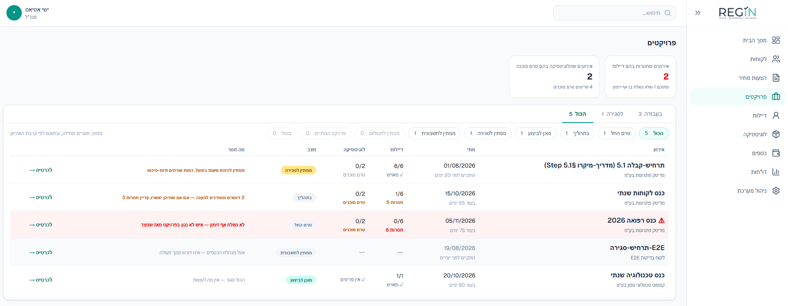
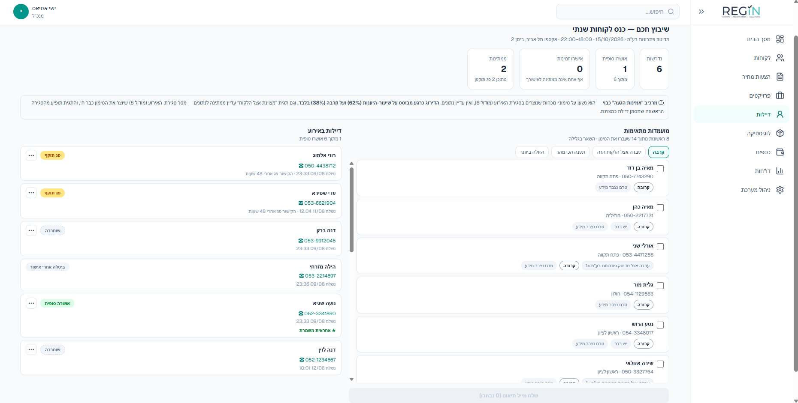
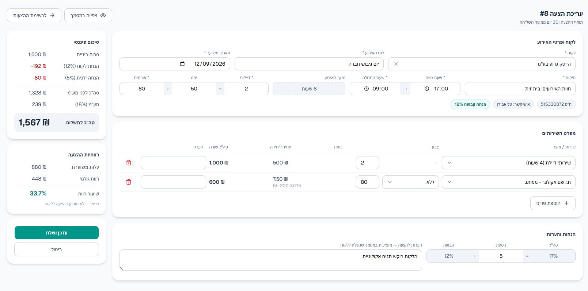
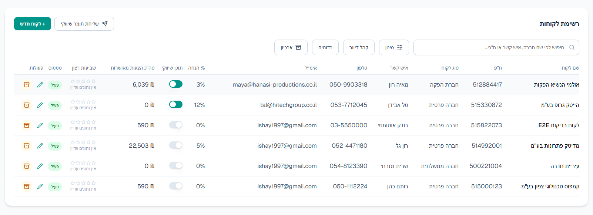
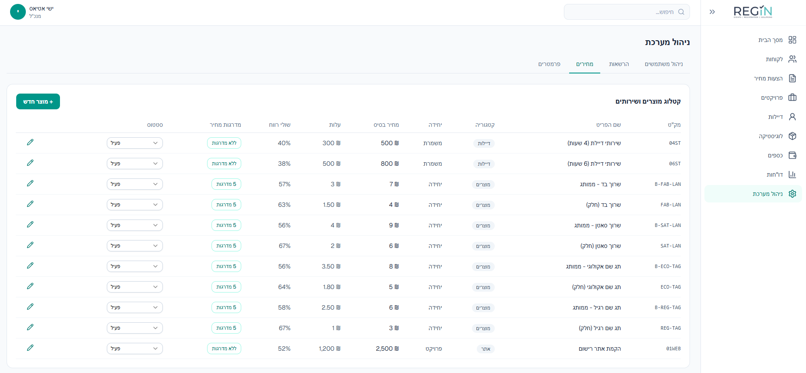
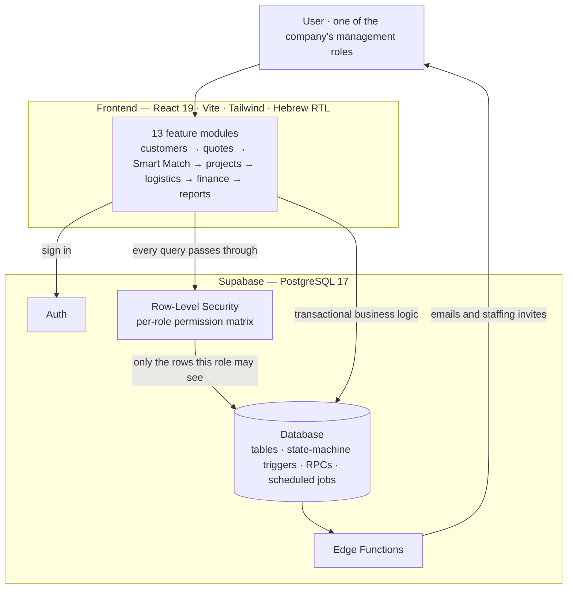
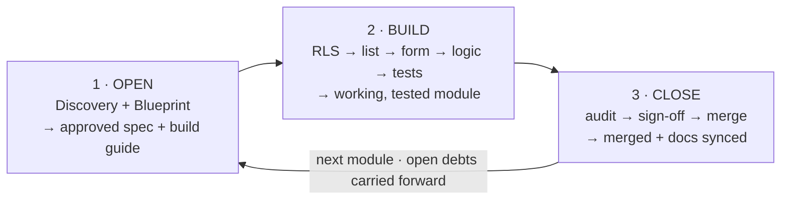

# REG-IN

**An integrated business-management system for an events & conference staffing company** — replacing scattered spreadsheets and WhatsApp groups with a single, role-secured platform that carries a job from the first client call all the way to financial close.

<!-- Tech badges — optional, add when ready:
  
-->

---

## Overview

REG-IN manages the full operational lifecycle of an events company as one connected flow:

> **Client → auto-priced Quote → approved Project → smart staff matching → Logistics checklist → Event → Financial closing → Management reports**

Instead of an Excel file per stage and a WhatsApp group per event, everything lives in one system with **real, database-enforced permissions**. Each of the six company roles sees exactly what its job requires — and nothing else.

> Final-year academic software-engineering project: thirteen vertically-sliced modules, a live PostgreSQL database with Row-Level Security, and a full Hebrew right-to-left interface.

> 📖 **See also — [How REG-IN Was Built](docs/BUILD_METHOD.md):** the engineering method behind the app, with links to the specs, build plans and audit records that prove it.

## Screenshots

**Projects — the central hub.** Every event's staffing and logistics readiness at a glance, driven by an eight-status state machine.



**Smart Match — the staff-assignment engine.** Candidates scored by availability, reliability and proximity, with one-click assignment.



**The pricing engine.** Automatic tiered pricing, customer and manual discounts, VAT, and a live profit calculation the client never sees.



**Customer directory.** Per-customer discounts, marketing segmentation, and quote history.



**Product & service catalog.** Per-item costs and margins, managed in system settings.



## Key Features

- **Database-enforced access control.** A per-module permission matrix across the company's management roles, enforced by PostgreSQL Row-Level Security — so the UI physically cannot show data the database wouldn't return. Security lives in the data layer, not just the front end.
- **Automatic quote-pricing engine.** Tiered pricing, VAT snapshots, customer and manual discount rules, and PDF generation.
- **Smart Match** — a multi-factor staff-assignment algorithm scoring candidates on availability, reliability and proximity, with weights configurable from the database rather than hard-coded.
- **Project state machine** — an eight-status lifecycle from creation to financial close, advanced by database triggers and scheduled jobs, not by hand.
- **Audit-safe by design** — no hard deletes anywhere, snapshot-frozen financials, and transactional operational closing.
- **Hebrew RTL** across every screen.

## Tech Stack

| Layer | Technology |
|---|---|
| Frontend | React 19 · Vite 8 · JavaScript |
| UI / styling | Tailwind CSS 4 · shadcn/ui · Radix |
| Backend | Supabase — PostgreSQL 17 · Auth · Row-Level Security · Edge Functions |
| Routing | react-router-dom 7 |
| Testing | Vitest (unit) · Playwright (E2E + smoke) |
| CI / hosting | GitHub Actions · Vercel |

## Architecture

- **Thirteen modules (0–12)**, each built as a *vertical slice* — permissions (RLS) → list screen → form → business logic → tests — and delivered in strict dependency order.
- **Security model:** every screen's data is gated by RLS policies evaluated against a central `permissions` table. A missing permission returns *no rows*, never leaked data.
- **The Projects module is the hub:** an eight-state machine that ties quotes, staffing, logistics and finance together and drives status transitions automatically.



## Engineering Process

> This section is deliberate. The repository keeps the artifacts of *how* the system was built — not as clutter, but as evidence of the engineering discipline behind the app.

Every module runs through the same repeatable loop, shown here in three grouped stages for brevity (Discovery and Blueprint share the "Open" box below — see [`BUILD_METHOD.md`](docs/BUILD_METHOD.md) for why they're counted as four distinct stages there):



- **Built in dependency order, one vertical slice at a time.** The secure foundation (authentication + permissions) was built first, because every other module's security checks against it; leaf modules (dashboard, automations) come last, so that if time runs short, what's deferred is the least critical. Each module is a complete slice — permissions (RLS) → list → form → business logic → tests — finished before the next begins.
- **Discovery before code — real requirements engineering, not a coding sprint.** Every module opens with a structured *Discovery* session:
  - the real-world process is mapped from the product owner's field knowledge — stated for correction, never assumed, so the system models how the work *actually* happens;
  - each open design question is checked against how comparable industry systems solve it ([`docs/specs/**/world-sources.md`](docs/specs/)), so decisions are grounded in practice, not guesswork;
  - screens are mocked, and **every ruling is logged with its rationale** ([`docs/specs/**/discovery-log.md`](docs/specs/)).

  Only once processes, screens and decisions are approved is a build guide generated — and only then does code begin. The result: **no line of code exists without a documented *why* behind it** ([`docs/PROJECT_MASTER.md`](docs/PROJECT_MASTER.md)).
- **Nothing ships unverified.** Every change runs a regression gate (lint · unit tests · duplication · dead-code · dependency audit); new tests are first proven to *fail* against intentionally-broken code before they are trusted; and an automated hook blocks a work session from ending if module code changed without its build guide and status board updated in the same session.
- **A test strategy chosen deliberately — and honest about its limits.** Unit tests pin the business logic (pricing math, Smart Match scoring); end-to-end tests exercise whole user flows; smoke tests guard the critical paths. And what automation *cannot* reach — real database writes, Hebrew RTL rendering, visual correctness — is covered by deliberate manual verification, so the gaps are closed on purpose rather than assumed away.
- **Nothing falls through the cracks.** Cross-module dependencies are tracked in an explicit *debt registry*: when building one module surfaces work that belongs to a **future** module, it is recorded with a tag (`🚧 →Module N`) and mechanically re-surfaced the moment that module is opened — so across a months-long, thirteen-module build, no requirement is silently dropped in the gap between modules.
### Working with AI — how correctness and control stayed with the developer

The system was built with an AI coding assistant (Anthropic's Claude Code), so three questions matter more than usual — and each has a concrete answer:

- **"How do you know it works?"** — Correctness is never taken on trust. Beyond the automated regression gate above, new tests are proven to *fail* against intentionally-broken code before they are trusted, and features are verified **live against the real database** through end-to-end user journeys — including confirming that each role is actually blocked from data it shouldn't see. Significant changes are independently reviewed before merge.
- **"How do you know it matches the spec?"** — Each module is accepted, screen by screen, against its approved Discovery spec before it counts as done. Nothing is "finished" because it compiles — only because it does what was specified.
- **"How did control stay with the developer?"** — The AI implements; the developer decides. Every requirement, every product and design decision, and **every irreversible action** — database schema changes, merges, module sign-offs — required explicit human approval before it happened. That approval is deliberately comprehension-forcing: applying a database migration, for example, requires the developer to **type the migration's name by hand** — a confirmation that cannot be given without first reading what the change actually does. The `docs/` tree records who decided what, and why.

> 📄 **The full method, with links to the real artifacts behind it:** [**How REG-IN Was Built**](docs/BUILD_METHOD.md) — the four-stage module loop, the quality and control mechanisms, and the specs, build plans and audit records that prove them.

## Getting Started

```bash
npm install
cp .env.example .env.local    # fill in your Supabase project URL and keys
npm run dev                   # http://localhost:5173
```

Quality gates:

```bash
npm run gate                  # lint + unit tests + duplication + dead-code + audit
npm run smoke                 # smoke end-to-end run
```

## Project Status

Built module by module toward a conference presentation. Completed and merged: the secure foundation (auth + permissions), customers, quotes, hostess Smart Match, and the projects hub. Remaining: logistics, finance & event closing, dashboard, settings, reports, automations, and final integration.

_The authoritative, always-current status board lives in [`STATUS.md`](STATUS.md), and the full roadmap in [`docs/guides/00_roadmap.md`](docs/guides/00_roadmap.md)._

## Academic Note

REG-IN is a final-year academic software-engineering project, built for a real events-and-conference company. AI (Claude Code) was used as a coding assistant throughout, under the team's direction and product ownership; the `docs/` tree documents the process end to end.

## License

© 2026 Ishay. All rights reserved. <!-- Or choose an open-source license if you prefer others to reuse the code. -->

---

<sub>Working on REG-IN day to day? The internal development guide lives in [`docs/DEV_HOME.md`](docs/DEV_HOME.md).</sub>
