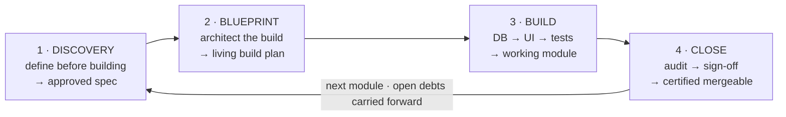

# How REG-IN Was Built — The Engineering Method

This document explains the disciplined, repeatable process behind REG-IN, and links to the real artifacts that prove it — the specifications, build plans, and audit records produced along the way. It exists because *how* the system was engineered is as much a part of the work as the running app.

REG-IN was built with an AI coding assistant (Anthropic's Claude Code) under direct human direction. The method below is what kept that collaboration rigorous: every requirement, product decision and irreversible action was the developer's, and the process was designed so that correctness is verified rather than assumed.

---

## The module loop

All thirteen modules were built one at a time, each through the same four-stage loop. A module does not start until the previous one is finished and signed off.

Each stage is codified as a reusable **skill** (an automation the assistant runs), so every module gets the same treatment: [`.claude/skills/module-discovery`](.claude/skills/module-discovery), [`module-blueprint`](.claude/skills/module-blueprint), [`module-build`](.claude/skills/module-build), [`module-close`](.claude/skills/module-close). Module 6 (Projects) is used below as the worked example, because its artifacts are the most complete.

---

## 1 · Discovery — define before you build

Discovery is requirements engineering, not a coding sprint. **No code is written.** The real-world process is mapped from the product owner's field knowledge (stated for correction, never assumed), each open design question is checked against how comparable industry systems solve it, screens are designed, and **every decision is recorded with its rationale**. Only the approved output of this stage — not the original frozen brief — becomes the source of truth for the build.

The evidence, for module 6:

| Artifact | What it is |
|---|---|
| [`docs/specs/module_06_projects/spec.md`](docs/specs/module_06_projects/spec.md) | The approved specification: locked vocabulary, the ordered reading list, the **"what counts as working"** acceptance criteria, the testable numbers, and an explicit list of what the blueprint is *not* allowed to guess. |
| [`screens-approved.md`](docs/specs/module_06_projects/screens-approved.md) | The **approved screen designs** — one card per screen: every click, the source of every number on screen, permissions, states, and validations. |
| [`processes-approved.md`](docs/specs/module_06_projects/processes-approved.md) | The **rulings** — 38 numbered decisions, the process flows, the project state machine, and the formulas. |
| [`discovery-log.md`](docs/specs/module_06_projects/discovery-log.md) | The **evidence trail** behind every ruling — written as the work happened. |
| [`world-sources.md`](docs/specs/module_06_projects/world-sources.md) | The external references each design choice was grounded in — a ready answer to *"why did you choose it this way?"* |

> When an approved spec already exists (the normal case), the product-manager interview is deliberately **skipped** — re-asking the owner to re-decide what he already decided is not thoroughness. What survives is a fresh-eyes blind-spot pass over the plan.

## 2 · Blueprint — architect before you code

The blueprint turns the approved spec into a **living build plan** — the module's *micro-guide*. Again, **no code is written in this stage.** The architect validates the module's place in the dependency graph, runs a database-design challenge for anything touching the schema, and triages every open gap into *must-decide-now* (brought to the owner) versus *decide-later* — and never resolves an open product question on its own.

The output is the nine-section micro-guide that the build stage executes: [`docs/micro_guides/module-6.md`](docs/micro_guides/module-6.md). Its most telling sections:

- a **Decisions Ledger** — product, architecture and screen rulings, each traceable, plus the items still open and owned by the human;
- a **Security & Auth model** naming the exact row-level-security policy for every table;
- a **phase-and-step plan** (the build order below);
- an **as-built / deviations log** — dated entries recording where reality differed from the plan and why.

## 3 · Build — vertical slices, database-first, test-first

Only now is code written — following the micro-guide, **database and permissions (RLS) before any UI**. Each module is built as a *vertical slice*, in this order (from [`docs/guides/00_roadmap.md`](docs/guides/00_roadmap.md)):

> **permissions (RLS) → list screen → form → business logic → tests**

and the thirteen modules themselves are built in dependency order (`3 → 4 → 6+5 → 8 → 9 → 7 → 11 → 10 → 12`), with the secure foundation (authentication + permissions) first because every other module's security checks against it.

Discipline during the build:
- **No silent gap-filling.** If something is unclear, the approved spec is consulted; a genuine gap goes to the owner, it is never guessed.
- **Test-first for business logic.** Pricing math and the Smart Match scoring were written test-first, and new tests are proven to *fail* against intentionally-broken code before they are trusted.
- **A human checkpoint before each build unit** — a plain-language "here's what I'm about to build and why" brief, which waits for approval.
- **A three-attempt cap** on any fix before stopping and reporting, so the build never spirals.

## 4 · Close — audit, sign-off, and only then merge

Closing a module is run by an independent audit — ideally in a **fresh session**, so it re-verifies from scratch rather than trusting the session that did the building. It stress-tests the row-level-security rules, audits UX and validation, builds a test-coverage matrix, and issues a formal **merge verdict**. Crucially, the audit **does not merge, push, or open a pull request** — it only certifies the module is *ready* to merge; the human does the actual merge.

**Honest evidence that the gate is real, not a rubber stamp:** module 6's closing audit returned **[NO] — with three blockers** (two of them needing a database fix). They were fixed, re-verified end-to-end, and only then was the module signed off. The full audit record: [`docs/archive/close-findings-module-6.md`](docs/archive/close-findings-module-6.md). A process that *catches* problems is stronger evidence than a claim of perfection.

---

## How correctness and human control were kept — the cross-cutting mechanisms

These run across all four stages, and are the direct answer to *"it was built with AI — how do you know it works, that it matches the spec, and that you stayed in control?"*

**Correctness is verified, not assumed.** Every change runs a regression gate (lint · unit tests · duplication · dead-code · dependency audit); new tests must first fail against broken code; and features are verified **live against the real database**, including confirming that each role is actually blocked from data it shouldn't see.

**Two irreversible actions are gated by a typed confirmation you cannot give without reading.** To apply a database migration, the developer must **type the migration's name by hand** — not "yes", not "approve" ([`supabase/migrations/CLAUDE.md`](supabase/migrations/CLAUDE.md)). To sign off a module, the developer types the module name plus `DoD`. Typing the exact name is only possible after reading what is being approved. These are the only two such gates in the project, by design.

**A comprehension check at every close.** The closing artifact ends with three plain-language questions about behaviour the owner will have to live with (*"a hostess cancels two days before the event — what happens now, and what must you do by hand?"*). It is a **signal, not a gate**: a wrong answer means "stop and walk through it", because a question the owner cannot answer is the cheapest possible sign that the built behaviour and his intent have diverged.

**Every decision passes four tests** (from the project's root guide, in the owner's own words — *"so an engineer looking at the code is impressed, and I have good explanations if asked at the conference why I chose this way"*):
1. **Feasible** — what does it actually run on? If nothing concrete exists, it's a wish, not a proposal.
2. **Connected** — who already decided something similar? A similar component behaving differently is a contradiction to resolve, not a free choice.
3. **An engineer would be impressed** — one consistent system, not a pile of special cases.
4. **Explainable in one sentence** — without citing a document. If the whole answer is "because the spec says so", that's copying, not deciding.

**The documentation cannot silently rot.** A session that changes module code cannot end until the matching build guide, the status board, and the work log are updated in the same session — enforced mechanically by a local Stop hook ([`.claude/hooks/check-docs-updated.sh`](.claude/hooks/check-docs-updated.sh)). *(This is a local enforcement, not a cloud CI check.)*

**Nothing falls through the cracks between modules.** When building one module surfaces work that belongs to a future module, it is recorded as a tagged debt in a central registry — schema changes in [`docs/db_roadmap.md`](docs/db_roadmap.md), cross-module debts and still-open product decisions in [`docs/PROJECT_MASTER.md`](docs/PROJECT_MASTER.md) (§6 debts, §7 open questions) — and mechanically re-surfaced the moment that module opens. So across a months-long, thirteen-module build, no requirement is quietly dropped, and no open product question is decided without the owner.

---

## A note on precision

A few things are stated exactly, because accuracy is part of the point:
- The loop is **four** stages — Discovery is a distinct step from Blueprint, and produces the approved spec *before* any plan is drawn.
- The closing audit **certifies** a module as mergeable; it never performs the merge — that decision stays with the human.
- The smoke / end-to-end suites and the documentation-sync check are enforced **locally** (git hooks and the quality gate), not by cloud CI — so the enforcement is real, but it lives on the developer's machine.

For the day-to-day working guide (for anyone developing REG-IN), see [`docs/DEV_HOME.md`](docs/DEV_HOME.md).
