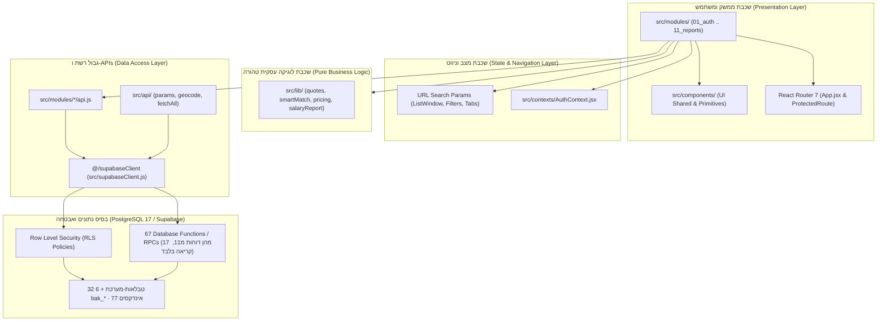

<div dir="rtl">

# מפת הקוד המלאה — Reg-In Architecture & Code Map

> **מקור אמת הנדסי למבנה הקוד, שכבות המערכת, תלויות הנתונים ורישום הקבצים הרגישים.**
> כל ספירות השורות נמדדו ישירות על עץ הקבצים הפעיל.
> ✏️ **רוענן 16/09/2026 19:4X (מודול 11, פזה 4).** השורות שנמדדו מחדש באותו רגע: `src/modules/11_reports/` (חדשה) · `src/lib/` · `supabase/migrations/` · `e2e/` · `src/modules/09_settings/`.
> 🔴 **הפקודה, כדי שהמספר הבא יימדד ולא יישען על זה שלפניו:** ‏`find <dir> -type f | wc -l` לקבצים, ו-`find <dir> -type f -print0 | xargs -0 cat | wc -l` לשורות.
> 🚫 **ולא `Measure-Object -Line`** — הוא מדלג על שורות ריקות ומזייף את הספירה (חוק-ברזל §2.5 ב-`CLAUDE.md`).

---

## 1. ארכיטקטורת שכבות וזרימת נתונים (Data Flow & Layers)



---

## 2. טבלת מיפוי שכבות ותיקיות (Directory Mapping Table)

| נתיב תיקייה | תפקיד ארכיטקטוני | קבצים מרכזיים | קבצים | סה"כ שורות | אינווריאנטים קריטיים ומלכודות |
|---|---|---|:---:|:---:|---|
| `src/` | שורש אפליקציית הלקוח | `App.jsx`, `main.jsx`, `index.css`, `supabaseClient.js` | 7 | ~1,200 | • ייבוא לקוח Supabase אך ורק מ-`@/supabaseClient`.<br>• אין `tailwind.config.js` — כל העיצוב ב-`src/index.css` תחת `@theme inline`. |
| `src/api/` | שירותי API גלובליים ומשותפים | `fetchAll.js`, `geocode.js`, `params.js` | 7 | 670 | • שירות הגיאוקודינג מנרמל כתובות ללא פגיעה בחסימת רשת.<br>• `params.js` טוען את כל מפת הפרמטרים במכה בודדת. |
| `src/components/` | רכיבי UI משותפים ומעטפת | `ListWindow.jsx`, `RatingStars.jsx`, `StatusTag.jsx`, `FilterPill.jsx` | 14 | 2,150 | • רכיב `ListWindow` אחראי על חלון 3 חודשים ודפדוף 50 שורות אחיד בכל המערכת.<br>• `ErrorBoundary` עוטף את כל הניתוב הראשי. |
| `src/components/layout/` | שלד האפליקציה וסרגל הניווט | `MainLayout.jsx`, `Sidebar.jsx`, `Topbar.jsx`, `ProtectedRoute.jsx` | 5 | 820 | • סרגל הצד יושב פיזית בצד ימין (`right-0`). תוכן המסך מוסט ב-`mr-60`.<br>• `Sidebar` מסנן מודולים לפי מטריצת הרשאות `view`/`edit`. |
| `src/components/ui/` | רכיבי shadcn/ui פרימיטיביים | `dialog.jsx`, `select.jsx`, `button.jsx`, `table.jsx`, `switch.jsx` | 25 | 668 | • מותאמים ידנית ל-RTL מלא (`components.json` מוגדר `rtl: false` כדי ש-CLI לא ידרוס).<br>• כל פופאפ/דיאלוג מקבל `dir="rtl"` מפורש בפורטל. |
| `src/contexts/` | מצב גלובלי של משתמש והרשאות | `AuthContext.jsx` | 1 | 263 | • `AuthContext` מספק `user`, `role`, ו-`permissions`.<br>• אינו חוסם רשת לבד — כל אכיפת האבטחה האמיתית ב-RLS. |
| `src/lib/` | לוגיקה עסקית טהורה וחישובים | `quotes.js`, `smartMatch.js`, `pricing.js`, `salaryReport.js`, `reportsFormat.js`, `reportsExport.js` | 90 | 27,109 | • פונקציות טהורות ללא תופעות לוואי.<br>• 100% מכוסות בבדיקות יחידה (`*.test.js`).<br>• שום חישוב כספי אינו מומצא בקומפוננטה. |
| `src/modules/01_auth/` | אימות, ניהול משתמשים ומחירון | `LoginPage.jsx`, `UsersManagementPage.jsx`, `PermissionsMatrixPage.jsx`, `PricesManagementPage.jsx` | 9 | 2,445 | • מודול היסטורי שללא שכבת `api.js` ייעודית (פניות ישירות).<br>• הרשאות מנוהלות לפי תפקידים (`roles`). |
| `src/modules/02_customers/` | ניהול לקוחות, אנשי קשר ודירוג | `CustomersPage.jsx`, `CustomerDetailsPage.jsx`, `CustomerFormDialog.jsx`, `api.js` | 13 | 5,516 | • מודול הייחוס למוסכמות ארכיטקטורה.<br>• שמירת אנשי קשר בטרנזקציה אטומית דרך RPC.<br>• כל הסינונים והדפדוף חיים ב-URL Search Params. |
| `src/modules/03_quotes/` | מנוע הצעות מחיר, הנחות ו-PDF | `QuotesPage.jsx`, `QuoteEditorPage.jsx`, `quotePdf.jsx`, `api.js` | 13 | 4,318 | • מנוע תמחור רגיש עם נעילת מע"מ.<br>• המרת הצעה לפרויקט דרך RPC בלבד (`approve_quote_and_create_project`).<br>• תבנית PDF רצה דרך `@react-pdf/renderer` עם הטמעת לוגו כ-Data URI. |
| `src/modules/04_hostesses/` | מאגר דיילות ושיבוץ חכם | `HostessesPage.jsx`, `OverviewTab.jsx`, `RepositoryTab.jsx`, `SmartMatchPage.jsx`, `api.js` | 14 | 5,890 | • אלגוריתם Smart Match משקלל 4 זוויות: מרחק גיאוגרפי, דירוג, ניסיון קודם, וזמינות.<br>• עדכון שכר ופרטי בנק כפוף לפוליסות RLS קפדניות. |
| `src/modules/05_logistics/` | ציוד ורשימות תיוג לאירוע | `LogisticsPage.jsx`, `ChecklistDialog.jsx`, `SegmentedControl.jsx`, `api.js` | 8 | 3,845 | • סינכרון ציוד ישירות מול שורות השירותים בהצעה/פרויקט.<br>• ניהול סטטוסי ציוד: ממתין / נארז / סופק. |
| `src/modules/06_projects/` | ניהול פרויקטים ומכונת מצבים | `ProjectsPage.jsx`, `ProjectCardPage.jsx`, `TeamTab.jsx`, `LogisticsTab.jsx`, `ClosingTab.jsx`, `ScopeChangeDialog.jsx`, `api.js` | 20 | 10,586 | • המחבר המרכזי של המערכת.<br>• מכונת מצבים: טיוטה ➔ פעיל ➔ ממתין לסגירה ➔ נסגר תפעולית ➔ הושלם / בוטל.<br>• שינויי היקף (Scope Change) נרשמים עם צילום מצב של עלות ומחיר יחידה. |
| `src/modules/07_dashboard/` | מסך הבית ולוח אירועים מרכזי | `DashboardPage.jsx`, `api.js` | 8 | 1,395 | • 4 אריחי מדדים ליבתיים + לוח שנה חודשי מלא.<br>• שאילתת סיכום אופטימלית בשרת (`get_dashboard_summary`) שמחזירה נתונים ב-~40ms. |
| `src/modules/08_finance/` | כספים, גבייה, שכר וסגירת אירוע | `FinancePage.jsx`, `SalaryReportDialog.jsx`, `ClosingWindowDialog.jsx`, `PublicFeedbackPage.jsx`, `api.js` | 11 | 10,575 | • ניהול תזרים, גיול חובות, מע"מ ורווחיות גולמית.<br>• סגירת אירוע כספית מאמתת שעות מול נוכחות דיילות בפועל ומקפיאה תעריפים.<br>• הפקת דוחות שכר חודשיים עם יצוא Excel/PDF. |
| `src/modules/09_settings/` | הגדרות מערכת, פרמטרים ותבניות | `ParamsTab.jsx`, `SmartMatchPane.jsx`, `BelowMinWageList.jsx`, `TemplateEditor.jsx`, `MySettingsPage.jsx`, `api.js` | 21 | 4,451 | • SSOT לכל פרמטרי המערכת (`params`).<br>• עריכת תבניות אימייל וניהול התראות.<br>• ‏**המסך מציג את כל שורות ה-`params`, ואין כאן מספר קשיח** — מ11 הוסיף ארבע שורות (16/09/2026) ושלוש הערות שנקבו ב-"43" הוסרו במקום לעודכן. |
| `src/modules/11_reports/` | 🆕 דו"חות מנהלים — 16 משטחים בארבע לשוניות | `ReportsPage.jsx` (מעטפת), `api.js`, `reportsCatalog.js`, `reportsPeriod.js`, `components/` (`ReportSurface` · `ChartCard` · `KpiTile` · `ReportTable` · `ExportBar` · `Envelope` · `DrillCrumbs` · `ReportChips` · `FiltersBar`), `tabs/` (Executive · Finance · Hostesses · Customers) | 44 | 12,289 | • **קריאה בלבד** — אינו משנה אף נתון עסקי, וכל שאילתה היא RPC דרך `api.js` (`callReport`).<br>• 🔴 **‏`ReportSurface` הוא המרנדר היחיד** — כל לשונית מאצילה לו דרך חמש חריצי-הרחבה (`transformPayload` · `renderTop` · `renderBeforeChart` · `renderBeforeTable` · `renderExtras` + השלושה של סבב-3). **העתקת המעטפת בין לשוניות מפילה את `jscpd` ב-3%.**<br>• 🔴 **השער הוא של המודול שמחזיק את הדאטה, לא של 'דו"חות'** (הכרעה 2): הנהלה+כספים ⇐ `'כספים'` · דיילות ⇐ `'דיילות'` · לקוחות ⇐ `'לקוחות'`. לשונית חסומה **ממוסכת ולא מוסתרת**.<br>• 🪤 **הגרפים הראשונים בריפו** (recharts): `<div dir="ltr">` סביב `ResponsiveContainer`, כותרת עברית מחוצה לו, טולטיפ `dir="rtl"`, וטבלת-תאום `sr-only` לכל גרף.<br>• 🪤 **כשל-רשת לעולם אינו "אין נתונים"** — `PermissionAwareEmpty state="error"` + *"נסי שוב"*; ושורת-`params` חסרה מציגה *"חסר פרמטר מערכת: X"* ולא ברירת-מחדל שקטה. |
| `src/lib/reports*.js` + `onboardingCopy.m11.*.js` | הלוגיקה הטהורה והמלל של מודול 11 | `reportsFormat.js`, `reportsExport.js`, `reportsParams.js`, `reportsExecutive.js`, `reportsFinance.js`, `reportsHostesses.js`, `reportsCustomers.js` (+ `*.test.js` לכל אחד) | 18 | 3,947 | • פונקציות טהורות בלבד — כל חישוב שנבדק ב-Vitest יושב כאן ולא בקומפוננטה.<br>• 🔴 **הייצוא עובר ב-`write-excel-file` עם `rightToLeft: true`** (התקדים: `salaryReport.js:39`). בלעדיו אקסל פותח מסמך עברי עם עמודה A משמאל — **ואין בדיקה בריפו שתופסת זאת.**<br>• ‏`reportsFormat.js` עוטף כל מספר ב-LRI…PDI; ₪ **אחרי** הספרות עם רווח. |
| `supabase/migrations/` | היסטוריית מיגרציות ומסד נתונים | 109 קובצי מיגרציה `.sql` | 109 | 41,159 | • מקור האמת היחיד לשינויי סכמה.<br>• מנוהל תחת שער בלתי-הפיך ופרוטוקול Expand-Contract.<br>• ⚠️ **קובץ אחד יכול להחזיק כמה שורות `schema_migrations`** (תקרת ~90KB ב-`apply_migration`) — הרשם ב-`docs/db_roadmap.md §10ב` עוקב אחרי **קבצים**. |
| `e2e/` | בדיקות קצה-לקצה ונגישות | 25 קובצי `.spec.js` — כולל `reports.spec.js`, `smoke.spec.js`, `accessibility.spec.js` | 25 | 8,499 | • בדיקות Playwright מבודדות רשת (Mocking דרך `page.route`).<br>• אפס הזרקת שורות בדיקה למסד החי. |

---

## 3. פנקס הקבצים המסוכנים ביותר (Top Risky Files Register)

קבצים אלה מרכזים את הלוגיקה המורכבת ביותר במערכת. כל שינוי בהם דורש זהירות עילאית ואימות יסודי:

```
┌────────────────────────────────────────────────────────────────────────────────────────┐
│                        Top 12 High-Risk Core Files in Reg-In                           │
├────┬─────────────────────────────────────────────────┬───────┬────────────────────────┤
│ #  │ נתיב הקובץ                                      │ שורות │ מוקד סיכון עיקרי       │
├────┼─────────────────────────────────────────────────┼───────┼────────────────────────┤
│ 1  │ src/modules/08_finance/ClosingWindowDialog.jsx   │ 2,141 │ חישוב כספי, שכר וגבייה │
│ 2  │ src/modules/06_projects/ClosingTab.jsx          │ 1,363 │ נעילת שעות ואישור שכר  │
│ 3  │ src/modules/02_customers/CustomerDetailsPage.jsx│ 1,337 │ סנכרון URL וניהול מגעים│
│ 4  │ src/modules/08_finance/SalaryReportDialog.jsx   │ 1,261 │ נעילת חודש ויצוא שכר   │
│ 5  │ src/modules/08_finance/FinancePage.jsx          │ 1,226 │ קוקפיט כספי ודוחות רווח│
│ 6  │ src/modules/06_projects/ScopeChangeDialog.jsx   │ 1,196 │ שינוי היקף פרויקט חי   │
│ 7  │ src/modules/02_customers/CustomersPage.jsx      │ 1,091 │ סינון ופאגינציה ב-URL  │
│ 8  │ src/modules/04_hostesses/api.js                 │ 1,037 │ שאילתות שיבוץ ומרחקים  │
│ 9  │ src/lib/quotes.js                               │   969 │ מנוע תמחור והנחות      │
│ 10 │ src/modules/05_logistics/ChecklistDialog.jsx     │   957 │ רשימות ציוד והקצאות    │
│ 11 │ src/modules/04_hostesses/SmartMatchPage.jsx      │   932 │ אלגוריתם שקלול דיילות  │
│ 12 │ src/modules/03_quotes/QuotesPage.jsx             │   927 │ ניהול הצעות ואישורים   │
└────┴─────────────────────────────────────────────────┴───────┴────────────────────────┘
```

### פירוט המלכודות בקבצי העילית:

1. **`src/modules/08_finance/ClosingWindowDialog.jsx` (2,141 שורות):**
   - **תפקיד:** הדיאלוג הסופי לסגירת אירוע פיננסית — חישוב שכר דיילות סופי, ניכויי איחור/היעדרות, נסיעות (₪22.60 ליום), תוספות בונוס, חישוב רווחיות גולמית סופית, רישום חשבוניות וקבלות.
   - **מלכודת שקטה:** אי-הקפאת תעריף שכר בעת סגירה עלולה לגרום לחישוב מחדש לפי תעריף שונה בעתיד. כל חישוב שכר חייב להתבסס על `hourly_rate_snapshot` הקפוא מיום האירוע.

2. **`src/modules/06_projects/ClosingTab.jsx` (1,363 שורות):**
   - **תפקיד:** לשונית סגירה תפעולית — דיווחי נוכחות בפועל של דיילות, אישור שעות והעברה לכספים.
   - **מלכודת שקטה:** שינוי סטטוס סגירה תפעולית ללא אימות מלא של שעות הנוכחות משאיר פרויקטים בסטטוס "סגור" עם שעות 0 במסד.

3. **`src/modules/02_customers/CustomerDetailsPage.jsx` (1,337 שורות):**
   - **תפקיד:** דף לקוח מפורט — חוזי אנשי קשר, היסטוריית הצעות ופרויקטים, ציוני שביעות רצון.
   - **מלכודת שקטה:** עבודה עם URL State מחייבת שימוש ב-functional setter `set(prev => ...)`. העברת ערך ישיר עלולה להמיר פונקציות למחרוזות ולשבור את הניווט. בנוסף, עדכון אנשי קשר מחייב קריאה ל-RPC `replace_customer_contacts` בלבד.

4. **`src/modules/06_projects/ScopeChangeDialog.jsx` (1,196 שורות):**
   - **תפקיד:** שינוי כמויות והיקף של פרויקט חי שכבר נחתם.
   - **מלכודת שקטה:** שליחת הדלתא (`delta_qty`) במקום הכמות החדשה הכוללת (`target_qty`) אל ה-RPC תגרום להכפלת שורות ושיבוש עלויות. הדיאלוג חייב תמיד לשלוח את היעד החדש.

5. **`src/lib/quotes.js` (969 שורות):**
   - **תפקיד:** ליבת חישוב התמחור, מדרגות מחיר, הנחות מיוחדות, ושיעורי מע"מ.
   - **מלכודת שקטה:** עיגולי אגורות צריכים להתבצע אך ורק בסוף החישוב ולא בכל מכפלת ביניים, למניעת סטיות של שקלים בסיכום הכולל.

</div>
