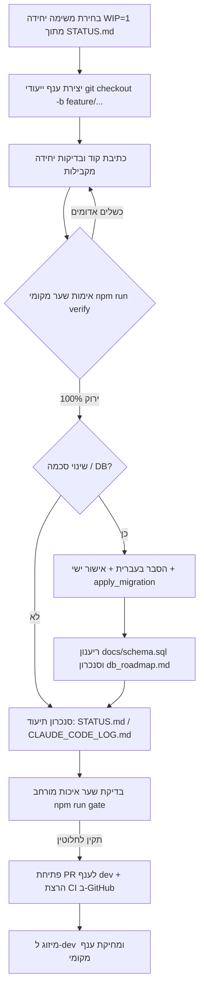

# תהליך הפיתוח והשילוב (Developer Workflow & Quality Gates)

> **ספר הפעלה תפעולי לסדר העבודה היומיומי, ניהול ענפים, פרוטוקול WIP=1 ושערי איכות לפני מיזוג**  
> מפה מלאה של כל קובצי המערכת: [docs/CODE_MAP.md](CODE_MAP.md).

---

## 1. מחזור חיי פיתוח משימה (Development Lifecycle)

כל משימה, תיקון באג או הרחבת מודול מתנהלים לפי התהליך המחזורי הבא:

---

## 2. חוקי ברזל לסדר העבודה (Workflow Invariants)

1. **פרוטוקול משימה אחת בלבד (WIP = 1):**  
   עובדים על משימה אחת מוגדרת בכל רגע נתון. אין לפתוח משימה חדשה לפני שכל שלבי ה-DoD של המשימה הנוכחית הושלמו במלואם.
2. **משמעת ענפים (Branch Discipline):**  
   - ענף `main` — קוד הייצור הפעיל והיציב בלבד (נפרס ל-Vercel).
   - ענף `dev` — ענף השילוב הראשי (Integration Branch).
   - ענפי פיצ'ר/תיקון — נפתחים תמיד מ-`dev` לפי הפורמט: `feature/<module>-<description>` או `fix/<issue>`. לעולם אין לבצע commit ישיר ל-`main`.
3. **הגנת סופי שורה ועיצוב (Windows LF Invariant):**  
   המאגר כולו מנוהל ב-LF (`.gitattributes`). כל קובץ חדש או שינוי חייב לעבור אימות Prettier (`npm run format:check`). יצירת קבצים מתוכנתית על Windows מחייבת הגדרת הזנת LF מפורשת.
4. **שמירת היגיינת סודות:**  
   סודות, מפתחות API ומחרוזות חיבור אינם מועלים לעולם למאגר Git. סורק `gitleaks` רץ ב-CI ומונע מיזוג של קוד המכיל סודות גלויים.

---

## 3. שערי איכות מחייבים (Quality Gates)

| שער | פקודת הרצה | שלבים הנבדקים | דרישת מעבר |
|---|---|---|:---:|
| **Local Verify** | `npm run verify` | Lint (ESLint 10) + Prettier + בדיקות יחידה (Vitest) + בניית Vite | 100% ירוק |
| **Comprehensive Gate** | `npm run gate` | `verify` + בדיקת שכפול (`jscpd`) + קוד מת (`knip`) + פטורי אבטחה + תקינות Bidi + שלמות הקשר + מבנה מסמכים | 0 שגיאות (קוד יציאה 0) |
| **Pull Request CI** | GitHub Actions (`ci.yml`) | סריקת סודות (`gitleaks`) + Lint + בדיקות יחידה מבודדות + Build נקי | מעבר חובה למיזוג |
| **Live Smoke** | `npm run smoke` | בדיקת עשן מלאה של מסלול לקוח מול שרת dev מקומי (פורט 5173) | 0 כשלים |

---

## 4. פרוטוקול אדוות וסגירת משימה (Ripple Protocol)

בסיום עבודה על משימה, יש לוודא עדכון של מקורות האמת במערכת:
1. **הכרעות ארכיטקטוניות או שינויי מוצר:** נרשמות כחתימה `✅` ב-[docs/PROJECT_MASTER_sec7.md](PROJECT_MASTER_sec7.md).
2. **שינויי מסד נתונים:** מלווים בעדכון מיידי של [docs/schema.sql](schema.sql) וסימון המיגרציה ב-[docs/db_roadmap.md](db_roadmap.md).
3. **תיעוד שוטף:** רישום תמציתי של מהות השינוי ב-[docs/CLAUDE_CODE_LOG.md](CLAUDE_CODE_LOG.md).
4. **יישור לוח המצב:** עדכון הצעד הנוכחי ומצב המודול ב-[STATUS.md](../STATUS.md).

---

## 5. נוהל טיפול בקונפליקטים ותקלות חירום (Hotfix / Incident Triage)

1. **זיהוי קונפליקט במיזוג (Merge Conflict):**
   - ביצוע `git fetch origin` ומשיכת ענף היעד העדכני: `git merge origin/dev`.
   - פתרון ידני של הקונפליקט תוך שמירה קפדנית על אינווריאנטי הקוד.
   - הרצה מחייבת של `npm run verify` לפני השלמת ה-merge commit.
2. **תקלה קריטית בייצור (Urgent Incident):**
   - פתיחת ענף חירום מ-`main`: `hotfix/<incident-name>`.
   - תיקון כירורגי בלבד ללא שינויי מבנה נלווים.
   - בדיקת רגרסיה והרצת `npm run gate`.
   - מיזוג דחוף ל-`main` ומיד לאחריו סנכרון חוזר (back-merge) לענף `dev`.

