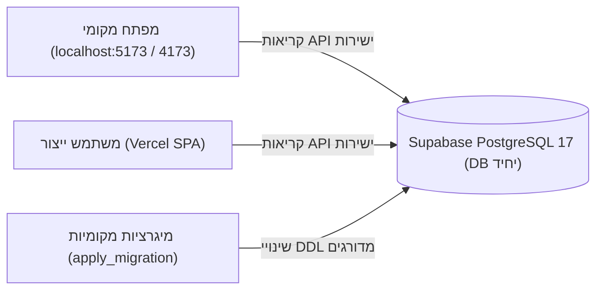

# ניהול סביבות, תצורה ושחזור מאסון (Environments & Disaster Recovery)

> **ספר הפעלה תפעולי לניהול סביבות העבודה, ארכיטקטורת מסד נתונים יחיד, משתני תצורה ונהלי שחזור מאסון (DR)**  
> מפה מלאה של כל קובצי המערכת: [docs/CODE_MAP.md](CODE_MAP.md).

---

## 1. מטריצת סביבות ההרצה (Environments Matrix)

המערכת פועלת בארכיטקטורה מבוססת ענן המשלבת מודל מסד נתונים יחיד:

| סביבה | כתובת / פורט | סוג שרת | תפקיד ופירוט | בסיס נתונים מקושר |
|---|---|---|---|---|
| **Local Dev** | `http://localhost:5173` | Vite 8 Dev Server (עם HMR) | פיתוח שוטף, דיבוג חי ובדיקות עשן (`npm run smoke`) | Supabase Live (`yfeovxppnfoafmfbdfvh`) |
| **Local Preview / E2E** | `http://localhost:4173` | Vite Preview (בנדל ייצור קפוא) | הרצת בדיקות קצה מלאות (`npm run test:e2e`) ללא הפרעות רענון | Supabase Live (יירוט רשת בבדיקות) |
| **Production** | Vercel Live Deployment | Vercel Edge SPA Hosting | אפליקציית הייצור המשרתת את משתמשי החברה | Supabase Live (`yfeovxppnfoafmfbdfvh`) |

---

## 2. מודל מסד הנתונים היחיד (Single Database Environment)

פרויקט Supabase יחיד (`yfeovxppnfoafmfbdfvh`, אזור `eu-west-3`, PostgreSQL 17) משרת הן את סביבת הפיתוח והן את סביבת הייצור.

### אינווריאנטים קריטיים הנגזרים מהמודל:
1. **המסד תמיד מקדים את הקוד שנפרס או שווה לו:**  
   ברגע החלת מיגרציה, השינוי מוחל מיידית בייצור. הקוד בייצור רץ מקומיט קודם עד למיזוג ופריסה.
2. **פריסה מדורגת (Expand-Contract):**  
   שינויי סכמה מבוצעים אך ורק במודל מרחיב-ואז-מצמצם: הוספת שדות/טבלאות מתאפשרת תמיד; מחיקת שדות או הידוק אילוצים מותרים רק לאחר שקוד הייצור עודכן ואינו קורא עוד את השדות הישנים.
3. **הגנת נתוני בדיקה:**  
   חל איסור מוחלט על הזרקת שורות בדיקה (INSERT/UPDATE מלאכותי) למסד הנתונים החי. כל בדיקות ה-E2E מתבססות על יירוט רשת (`page.route`).

---

## 3. ניהול סודות ומשתני תצורה (Configuration & Secrets)

| שכבה | מיקום | נכסים הנשמרים | הרשאות גישה |
|---|---|---|---|
| **פיתוח מקומי** | `.env.local` | `VITE_SUPABASE_URL`, `VITE_SUPABASE_ANON_KEY`, משתמשי בדיקה `E2E_*` | מקומי במחשב המפתח (מוחרג ב-`.gitignore`) |
| **תבנית ציבורית** | `.env.example` | שמות משתנים ללא ערכים אמיתיים | פומבי במאגר Git |
| **צינור אוטומציה (CI)** | GitHub Secrets | סודות סריקה ובדיקות הרצה ב-GitHub Actions | מנוהל בהגדרות המאגר ב-GitHub |
| **סביבת ייצור** | Vercel Environment Variables | מפתחות Supabase של סביבת הייצור | מוגדר בממשק הניהול של Vercel |

---

## 4. נוהל שחזור מאסון וגיבויים (Disaster Recovery & Restore)

### מדיניות גיבויים
1. **גיבויים מנוהלים ב-Supabase:** גיבוי יומי מלא אוטומטי של בסיס הנתונים + יומני עסקאות (WAL) המאפשרים שחזור לנקודת זמן (Point-in-Time Recovery).
2. **סנכרון סכמה מנוהל ב-Git:** הקובץ [docs/schema.sql](schema.sql) משמש כמקור אמת ארכיוני לכל מבנה הטבלאות, הפונקציות, הטריגרים ומדיניות ה-RLS.

### נוהל שחזור מתקלה (Rollback Procedure)
1. **תקלת קוד ייצור (Frontend Regression):**
   - ביצוע Instant Rollback בממשק Vercel לפריסה הקודמת (זמן ביצוע: < 30 שניות).
   - שחזור גרסה בענף `main` באמצעות `git revert` ומשיכת התיקון.
2. **תקלת מיגרציה / נתונים (Database Corruption):**
   - **בליעת נתונים מקומית:** שימוש בסקריפטי שחזור ייעודיים (כגון `scripts/restore_quotes_*.sql`).
   - **כשל סכמה חמור:** מיגרציות ב-Postgres הן Append-Only — תיקון מתבצע תמיד על ידי כתיבת מיגרציית תיקון חדשה קדימה (ולא עריכת קובץ קיים).
   - במקרה קיצון של אובדן נתונים כולל: שחזור ה-Snapshot האחרון מתוך לוח הניהול של Supabase.

