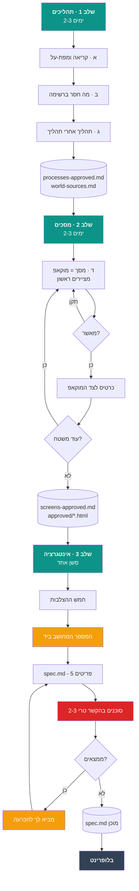

<div dir="rtl">

# 🗺️ מפת-ההפעלה של מודול — מה אתה מדביק, ומתי

> **מה זה:** התהליך שהפיק את האפיון של **מודול 4**, מפורק לצעדים שאתה יכול להעתיק-להדביק.
> **נכתב 08/08/2026** מתוך מה שעבד שם **בפועל**, כולל ההכרעות שלך שגרמו לו לעבוד.
>
> 🔴 **הדבר החשוב ביותר בקובץ הזה, ואם תזכור רק אותו זה מספיק:**
> **‏Discovery אינו סשן אחד. הוא 3–4 ימים.** ‏`spec.md` של מודול 4 יצא טוב **לא בגלל פרומפט טוב** —
> אלא כי כשהוא נכתב, כבר היו מתחתיו שלושה ימים של תהליכים ומסכים שאתה תיקנת בזמן אמת.
> **‏`spec.md` לא המציא כלום. הוא רק ריכז מה שכבר עבר בדיקה.**
>
> **קורא:** ישי. **את קובץ-הפרומפט עצמו** *(מה שקלוד קורא)* תמצא ב-
> [`prompt_module_discovery.md`](prompt_module_discovery.md) — **הקובץ הזה אומר לך מתי להדביק אותו.**

---

## התמונה הגדולה



🔑 **שני התיבות הצבועות הן מה שהכי הרוויח במודול 4:** ‏**המספר המחושב-ביד** (כתום) ו**הסוכנים
בהקשר-טרי** (אדום). **בלעדיהם האפיון היה נראה בדיוק אותו דבר — ושגוי.**

---

# שלב 1 · תהליכים *(2–3 ימים)*

**מה קורה:** קלוד קורא הכל, מציג לך את מפת-התהליכים, ואתה מתקן. **אין מסכים בשלב הזה בכלל.**

## מה אתה מדביק — פעם אחת בתחילת השלב

```
אנחנו עושים Discovery מלא למודול [N] — [שם המודול].
קרא את docs/guides/prompt_module_discovery.md ובצע אותו כלשונו, משלב 1.

לפני כל פעולה ענה על החמש האלה, כל תשובה עם הקובץ או הפקודה שהוכיחה אותה:
1. מה המצב הנוכחי של המשימה?
2. מה בדיוק המשימה שלך, ומה במפורש לא?
3. מה אסור לך להחליט לבד כאן?
4. מה כבר הוכרע ואסור לפתוח מחדש?
5. מה המוקש שאם תפספס אותו — זה יישבר בשקט?

ואז שתי שאלות שלך אליי: מה לא ברור לך? מה חסר בהוראות שנתתי?
```

> 🔑 **למה חמש השאלות האלה, ולמה הן שוות את השורות:** הן תפסו במודול 4 סשן שהיה מתחיל
> לעבוד על ההנחה השגויה. **התשובה ל-5 היא זו שמחזירה הכי הרבה** — היא מכריחה את קלוד להגיד
> בקול מה עלול להישבר **בלי שאף אחד ישים לב**.

## שלוש נקודות-עצירה שלך בשלב הזה

| | מה קלוד מביא | מה אתה עושה |
|:-:|---|---|
| **א** | מפת-על: מטרת המודול · כל התהליכים · **כל המשטחים** | **מאשר את רשימת-המשטחים.** בלי זה אין מכנה — כל השלבים הבאים סופרים מולה |
| **ב** | מה **חסר** ברשימת-התהליכים, כולל מה שיש בעולם ואין לנו — **עם ורדיקט לכל פריט** | מאשר / מוציא. **דחית משהו למודול אחר? זה חייב להירשם כחוב** |
| **ג** | כל תהליך כסיפור מההתחלה עד הסוף — מי מתחיל · מה נשמר · מה משתבש | מתקן. **פה אתה הכי שווה** — רק אתה יודע איך זה עובד בשטח |

**🔴 ומה שאתה חייב לדרוש בשלב ג, כי בלעדיו הבלופרינט ינחש:**
לכל תהליך — **כל סטטוס שהוא צריך · מי כותב כל מעבר · ומה עוגן-הזמן שלו.**

---

# שלב 2 · מסכים *(2–3 ימים)*

**מה קורה:** משטח אחד בכל פעם. **מציירים מוקאפ ראשון, לא כותבים תיאור.**

> 🔑 **וזו הכרעה שלך מ-06/08/2026, אחרי ששני כרטיסים מילוליים נכשלו.** במילותיך:
> *"מודה שלא כל כך הבנתי… אתה רוצה אולי **תמיד לעשות מוקאפ כפי שאתה מבין**, ואז מקסימום
> אתקן אותך?"* — **צדקת. ציור-מחדש של HTML זול; אי-הבנה שלך לא.**

## מה אתה מדביק בתחילת כל סשן-מסכים

```
ממשיכים במודול [N], שלב 2 (מסכים).
קרא docs/specs/module_[NN]_*/screens-approved.md — טבלת "מצב" בראש הקובץ
אומרת איפה עצרנו. המשך מהמשטח הבא.

לפני שאתה מצייר כל משטח:
- קרא את processes-approved.md של אותו תהליך במלואו, לא רק את כרטיס-המסך
- שאב את הפלטה מ-src/ עם grep, לא ממוקאפ קודם
- מוקאפ HTML עם דאטה אמיתית בקנה-מידה אמיתי, ואז עצור לאישורי
```

**‏🛑 עצירה שלך בכל משטח.** מסתכל, אומר "תקן X", מסתכל שוב, מאשר.

**⏱️ ואל תיתן לו לעשות יותר מ-2–3 משטחים בסשן אחד.** משטח אחד ≈ 85K מהחלון; מעבר לזה
הסשן מתחיל לייצר עבודה שתצטרך לעשות מחדש.

---

# שלב 3 · אינטגרציה *(סשן אחד)* — **וכאן ההבדל**

## מה אתה מדביק

```
ממשיכים במודול [N]. המשימה: לכתוב docs/specs/module_[NN]_*/spec.md
לפי docs/guides/prompt_module_discovery.md, "## שלב 3 · אינטגרציה" בלבד —
שלבים 1-2 בוצעו, אל תחזור עליהם.

בתוך שלב 3 יש "🛡️ בקרת-הצלבה" — חמש הצלבות מוגדרות.
בצע אותן כמו שכתוב; אל תמציא בקרה משלך.

הגרסה: צרה. מצביעים + ארבעת פריטי-החוזה, בלי לשכתב דבר.
העבודה האמיתית היא פריט 3 בלבד.
🚫 ואל תרשום אילו בדיקות לממש — האפיון נותן ציפייה אחת מחושבת-ביד,
הבלופרינט בונה ממנה את הבדיקה.

בסוף — שגר 2-3 סוכנים בהקשר-טרי לפני שאתה מציג לי, ואז דוח מרגיע
מבוסס-נתונים: שהבלופרינט ימצא הכל ולא יחסר לו מידע על DB, לוגיקה, מסכים, בדיקות.
```

## 🔢 פריט 3 — המספר המחושב ביד. **זה הלב.**

**מה זה:** מקרה מלא עם ערכים אמיתיים, **שקלוד מחשב ביד** מהנוסחאות. במודול 4 זה היה
**חמש דיילות, שתיים נפסלות בשער, והציפייה `0.67 · 0.66 · 0.64`.**

🔑 **ולמה דווקא זה, ולא "תכתוב בדיקות":** סשן-בלופרינט **יכול** להמציא בדיקה, אבל **אינו יכול**
להמציא את התוצאה הנכונה — היא דורשת לקרוא נוסחאות ולחשב. **ואם הוא יחשב אותה בעצמו,
הבדיקה תשווה את הקוד לעצמו.** ⇒ **שומר שאינו שומר.**

**העוגן שמוכיח שזה עובד:** במודול 3 המספר `6,319` הופיע **פעם אחת** באפיון ⇐ **33 פעמים**
במדריך-הבנייה ⇐ ומשם ל**עוגן-רגרסיה קבוע**. **מודול 4 לא היה לו מספר כזה עד ששלב 3 ייצר אחד.**

## 🔴 2–3 סוכנים בהקשר-טרי — **הצעד שהכי הרוויח**

**אישרת אותו כדפוס-קבע ב-08/08:** *"מרשה לך גם 2 סוכנים ליתר ביטחון זה מסמך ממש חשוב"*.

**למה זה לא ניתן לוויתור:** נמדד בריפו הזה — **קלוד תופס `0 מתוך 5` פגמים בארטיפקט שהוא
עצמו כתב.** ‏**כל מנגנון שכן עבד השווה מול עוגן חיצוני.**

**שלוש הזוויות שעבדו במודול 4 — תן לכל סוכן אחת, לא את שלושתן:**

| הסוכן | מה הוא מקבל | מה הוא מצא בפועל |
|---|---|---|
| **① בקר-מקורות** | *"אילו טענות כאן חסרות מקור — אמת כל אחת מול הריפו בעצמך"* + *"מה האפיון לא מזכיר שהבלופרינט יצטרך?"* | שכבת-מיילים שלמה שלא הוזכרה · 5 אי-התאמות בתוויות |
| **② מחשבן עצמאי** | *"חשב מחדש מהנוסחאות בלבד, וקרא את התוצאה שלי רק אחרי שכתבת את שלך"* | ✅ אישר 14/14 · **ומצא ש-`C` דו-משמעי** ושפרשנות שנייה נותנת **תיקו** |
| **③ סשן-בנייה מדומה** 🔑 | *"אתה בונה. **מותר לך לקרוא רק את הקבצים ברשימת-הקריאה.** כל מקום שתצטרך לנחש — זה ממצא"* | **שתי טענות שגויות שקלוד עצמו כתב** · עמודה פאנטומית · אילוץ שאינו בר-מימוש |

🔑 **והשלישי הוא שמצא הכי הרבה — כי הוא היחיד שהוגבל לשדה-הראייה של הצרכן האמיתי.**

---

# 🗣️ הציטוטים שלך — **מה אמרת, מתי, ומה זה שינה**

> **למה פרק שלם לזה:** את הפרומפט אפשר לשכפל; **את השאלות שלך אי-אפשר לשחזר מזיכרון.**
> כל שורה כאן היא **משפט אמיתי שאמרת** במהלך מודול 4, עם ההכרעה שיצאה ממנו.
> 🔴 **קרא את העמודה השמאלית לפני כל שלב — היא רשימת-השאלות שלך לאותו שלב.**

## בשלב 1 — תהליכים

| מה אמרת | מה זה שינה |
|---|---|
| *"אלא אם יש תהליכים או תתי תהליכים שפיספסנו"* | **התנית את נקודת-ההתחלה** ביישור-הרשימה קודם. בלי זה היינו מתחילים לתאר תהליך אחד בזמן ששניים חסרים |
| *"לא ממשיכים הלאה עד שאתה מתאר תהליך מההתחלה עד הסוף ואני מאשר… בלי הנחות וניחושים אם משו לא ברור זה הרגע שלנו ביחד"* | 🔑 **הכלל שהחזיק את כל השלב.** הפך "תאר לי" ל**שער** |
| *"רק מה שרלוונטי לפרויקט באמת — פה תכניס שיקול דעת"* | סינן מקרי-קצה מומצאים. **בלי זה מקבלים אפיון שמטפל בדברים שלא קורים** |
| *"רציתי רגע שנבין למה התכוונת שלא אפספס משו"* | 🔑 **תפס סינון בלתי-נראה.** בעקבותיו הוצגה טבלת-18-הפריטים המלאה, **ושלושה שהושמטו צפו** |
| *"האפיון לא תמיד נכון כי נכתב על ידי ואני לא יודע עד הסוף — בגלל זה יש את הסשן"* | 🔴 **הנחת-היסוד של כל ה-Discovery** — האפיון הקפוא הוא **חומר-גלם, לא סמכות** |
| *"מעולה, צריך רק לכתוב חוב מתאים להמשך"* | הדפוס שחוזר: **לא לתקן עכשיו — לרשום כחוב** |
| *"נראלי לא מאפשרים להשבית לא? מה בדרך כלל עושים? מה הכי הגיוני"* | ⚠️ **החזרת שאלה במקום תשובה** — וזה הוליד מחקר-עולם והמלצה, במקום ניחוש |

## בשלב 2 — מסכים

| מה אמרת | מה זה שינה |
|---|---|
| *"אנחנו בשיחה הולכים ליצור את כל המוקאפים אחד אחד עוברים על אחד מתקנים עד שאני מאשר"* | **קבע את הקצב של כל השלב** — משטח, תיקון, אישור |
| *"מודה שלא כל כך הבנתי… אתה רוצה אולי **תמיד לעשות מוקאפ כפי שאתה מבין**, ואז מקסימום אתקן אותך?"* | 🔴 **מיזג שני שלבים לאחד.** ‏"כרטיס מילולי ואז מוקאפ" בוטל — **מציירים ראשון** |
| *"תסתכל בקוד האמיתי, שיהיו צבעים אחידים ועקביים"* | **כלל-הפלטה:** שואבים מ-`src/`, לא ממוקאפ קודם. **תפס שתי הפרות באותו מוקאפ** |
| *"שלא יהיה בלבול מה כפתור ומה מוביל למה?"* ואז *"זה לא כפתור נכון?"* | 🔑 **הוליד את מפת-הלחיצות** — הסעיף הראשון בכל כרטיס-מסך |
| *"בסוף אתה כותב אפיון בעברית לקלוד, אז אולי הוא כן צריך תיאור מילולי"* | שאלה נכונה שהתשובה לה **לא** — כי המוקאפים HTML, וקלוד קורא אותם |
| *"מה זה עוזר אם היא עבדה? זה חלק מהאלגוריתם?"* | 🔴 **חשף ששני סוגי צ'יפים מוצגים זהה** — אחד בציון ואחד לא. **הפרדה שנכנסה למפרט** |
| *"חשבתי שהציון סתם יציק לה בעין"* | **הציון נשאר סמוי** והוחלף בצ'יפי-הנמקה. **אינטואיציה שהתבררה כנכונה** |
| *"אתה לא כותב בדיסקברי לוג?"* | ⚠️ **תפס שהיומן לא עודכן בלוק שלם.** קלוד לא תפס |
| *"אני זורם עם ההחלטות שלך"* · *"נותן לך להחליט על זה"* | 🔑 **האצלה — לא הסכמה.** משמעותה: **הנימוק צריך להיות חזק יותר, לא חלש יותר** |

## בשלב 3 — אינטגרציה, ובהכרעות

| מה אמרת | מה זה שינה |
|---|---|
| *"זה נתון לפרשנות, כל אחד יעשה בקרה מסוג אחר וככה דברים יתפספסו"* | 🔴 **הפך "תבדוק" ל**חמש הצלבות מוגדרות**. אחת מהן לבדה הניבה תשעה ממצאים |
| *"מרשה לך גם 2 סוכנים ליתר ביטחון זה מסמך ממש חשוב"* | 🔴 **הצעד שהכי הרוויח.** מצא **שתי טענות שגויות שקלוד עצמו כתב** |
| *"תעבור איתי הכרעה אחת אחת תבחן היטב את האפשרויות ותבוא עם **המלצה אחת עם סיבה**"* | הפך רשימות-אפשרויות להכרעות בנות-דקה |
| *"אין סיבה להוסיף עבודה גם אם זה שיפור נחמד"* | 🔑 **המסנן נגד ניפוח-סקופ** — נאמר על שיפור שקלוד הציע ונדחה |
| *"אני לא בטוח בכלל, יכול להיות שיותר נכון לעצור ולאפיין כמו שצריך את מודולים 5,6?"* | 🔴🔴 **הכי יקר.** מיסגרתי החלטת-מסך — **השאלה חשפה שאלת-סדר-עבודה**, ומשם התיקון ש"מוכן לביצוע" מעולם לא היה של מ4 |
| *"האם שקלת את כל האופציות?"* | **מכריח בדיקה מחדש של המסגור עצמו**, לא של התשובה |
| *"לדעתי כל הקטע עם הדירוג הוחלט במחקר לא?"* | ⚠️ **צדקת בחלק.** אילץ הפרדה בין *מה הוכרע* ל*מה נשאר* — וכך ההכרעה נסגרה במשפט אחד |
| *"זו הנחה מתוך הבנת העסק — יש תמיד דיילות ותגים לפחות"* | 🔑 **מסנן-מציאות.** סגר מקרה-קצה **בלי לבנות לוגיקה** |
| *"היית עושה אחרת עם הסטטוסים? יש מצב טעיתי"* | פתח בדיקה מלאה של מכונת-הסטטוסים. **התוצאה: צדקת** — ושני מקרי-קצה צפו בדרך |
| *"מה שהכי הגיוני וישים במערכת ומתחבר היטב עם כל התהליכים… שמהנדס יסתכל על הקוד ויתרשם לטובה, ושיהיה לי מה הסברים טובים אם ישאלו אותי בכנס"* | 🔴 **ארבעת המבחנים.** הפכו לכלל-ברזל ב-`CLAUDE.md` |

---

# ⚖️ שבעה כללים שלך שגרמו לזה לעבוד

*(אלה לא הוראות שנתתי לך — אלה דברים **שאתה אמרת** במהלך מודול 4, וכל אחד מהם שינה תוצאה.)*

| | הכלל, במילותיך | מה זה מנע |
|:-:|---|---|
| **1** | *"תבוא עם **המלצה אחת** עם סיבה"* | רשימות-אפשרויות שמעבירות אליך את העבודה |
| **2** | *"**אין סיבה להוסיף עבודה** גם אם זה שיפור נחמד"* | ניפוח-סקופ מתחת לדדליין |
| **3** | *"**לא קורה**"* — כמו *"יש תמיד דיילות ותגים לפחות"* | לוגיקה למקרים שאין להם קיום בשטח |
| **4** | *"תסתכל **בקוד האמיתי**, שיהיו צבעים אחידים"* | דריפט-עיצוב ממוקאפ למוקאפ |
| **5** | *"אולי תמיד לעשות **מוקאפ** כפי שאתה מבין?"* | כרטיסים מילוליים שאתה לא מבין |
| **6** | *"**מרשה לך 2 סוכנים** — זה מסמך ממש חשוב"* | ביקורת-עצמית שתופסת 0 מתוך 5 |
| **7** | 🔴 *"**אני לא בטוח בכלל** — יכול להיות שיותר נכון לעצור?"* | ההנחה שהמסגור שקלוד נתן הוא המסגור הנכון |

**‏🔑 ומספר 7 הוא היקר ביותר.** באותו רגע קלוד מיסגר החלטת-מסך מקומית; **השאלה שלך חשפה
שאלת-סדר-עבודה שלמה** — ומשם הגיע התיקון ש"מוכן לביצוע" מעולם לא היה של מודול 4.
**כשמשהו מרגיש לך גדול מהמסגור — תגיד. אתה צודק בזה יותר ממה שנדמה לך.**

---

# 🧭 וארבע השאלות שאתה שואל על כל דבר שמביאים לך

*(במילותיך, 08/08/2026 — הן כבר כתובות ב-`CLAUDE.md` ככלל-ברזל)*

**‏① הגיוני וישים?** על מה זה רץ — מה שקיים היום, או מה שרשום ברשם?
**‏② מתחבר, לא מבודד?** מי כבר הכריע משהו דומה במערכת?
**‏③ מהנדס יתרשם?** דפוס קיים, או חריג חדש שצריך להצדיק את עצמו?
**‏④ תוכל להסביר בכנס?** מה הסיבה במשפט אחד, **בלי לצטט מסמך**?

---

## ⏱️ כמה זה לוקח, מדוד ממודול 4

| השלב | בפועל |
|---|---|
| שלב 1 · תהליכים | **~2 ימים** |
| שלב 2 · מסכים | **~2 ימים** *(8 משטחים)* |
| שלב 3 · אינטגרציה | **סשן אחד ארוך** |
| **סה"כ** | **‏3–4 ימים למודול** |

⚠️ **ואל תדחוס.** במילים שכבר נמדדו כאן: *"אפיון שנכתב בחיפזון גרוע מאפיון שנעצר באמצע"*.

---

# 🎯 ואם תזכור רק שלוש שאלות — אלה השלוש

*(נבחרו מתוך כל מה שאמרת, לפי **כמה תוצאה הן שינו בפועל**.)*

**‏① *"רציתי רגע שנבין למה התכוונת שלא אפספס משו"*** — **שאל אותה בכל פעם שקלוד מצמצם רשימה.**
🔑 **שאלה שגויה אתה תופס; סינון שגוי אתה לא יכול לתפוס** — כי לא ראית מה ירד. **במודול 4 היא
החזירה שלושה פריטים שהושמטו**, אחד מהם סטייה-מהעולם שלא הייתה מתועדת.

**‏② *"אני לא בטוח בכלל — יכול להיות שיותר נכון ל…?"*** — **כשמשהו מרגיש גדול מהמסגור שקיבלת.**
🔑 **קלוד ממסגר את השאלה, ולפעמים ממסגר אותה קטן מדי.** הפעם זה הפך החלטת-מסך לתיקון-בעלות
בין שני מודולים. **התחושה שלך שמשהו לא יושב נכון — היא נתון, לא הפרעה.**

**‏③ *"היית עושה אחרת? יש מצב טעיתי"*** — **על משהו שאתה עצמך קבעת.**
🔑 **זה מה שנותן לקלוד רשות לבדוק את ההנחות שלך במקום לציית להן.** במודול 4 התשובה הייתה
"צדקת" — **אבל הבדיקה עצמה חשפה שני מקרי-קצה שאיש לא היה מוצא אחרת.**

> 🚫 **ומה שלא צריך לזכור: שום ניסוח מדויק.** שלוש השאלות עובדות בכל מילים.
> **מה שהופך אותן לעובדות הוא *מתי* אתה שואל, לא *איך*.**

</div>
