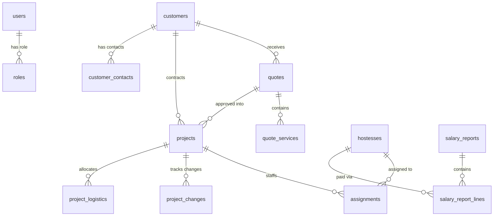

# ביקורת סכמת מסד נתונים ו-ERD (Database Schema Review)

> **מקור אמת:** `docs/schema.sql` ו-`supabase/migrations/`  
> **מפה עתידית:** `docs/db_roadmap.md`

---

## מבנה הטבלאות הליבתיות (15 טבלאות)

---

## אינווריאנטים קריטיים בסכמה
1. **הרשאות ובידוד נתונים:** RLS מופעל על כל הטבלאות. פונקציית `current_user_role_id()` מגדירה את זיהוי התפקיד.
2. **המרת הצעה לפרויקט:** מתבצעת דרך ה-RPC האטומי `approve_quote_and_create_project` (בדיקת תוקף, תפיסת מע"מ ויצירת פרויקט בטרנזקציה אחת).
3. **שינויי היקף (Scope Change):** נרשמים ב-`project_changes` ומחושבים אטומית דרך ה-RPC `apply_project_scope_change`.
4. **עדכון אנשי קשר:** מחיקה והכנסה חוזרת אטומית דרך `replace_customer_contacts` למניעת חלונות זמן שבהם לקוח נותר ללא איש קשר ראשי.

